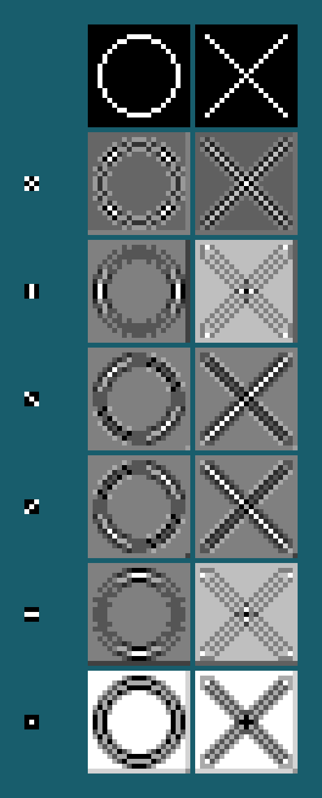

# image-convolver
version 2.4 of my image convolver. previous versions were not on github unfortunately.

running requires numpy, scipy, math, os, matplotlib, and inspect

## examples
for small images, the progress bar is partially disabled so that every convolution has a print() that says it is running. otherwise they may be too fast for all of the progress bars to print, even with print set to flush output

